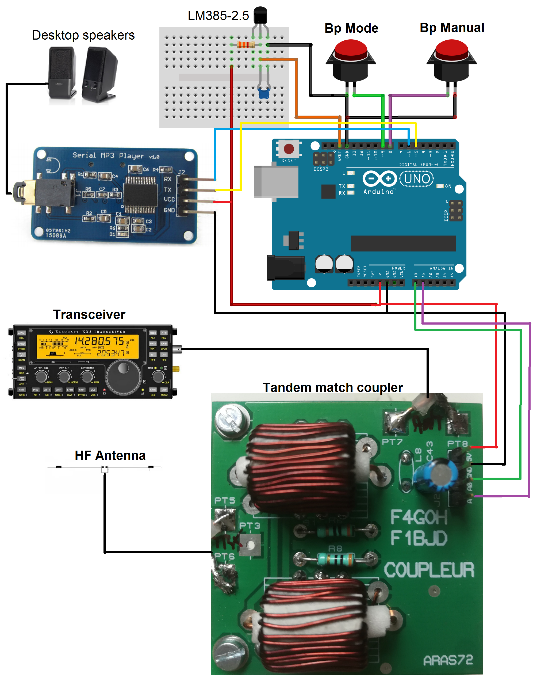
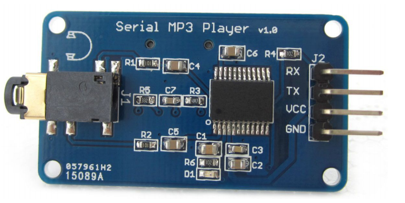
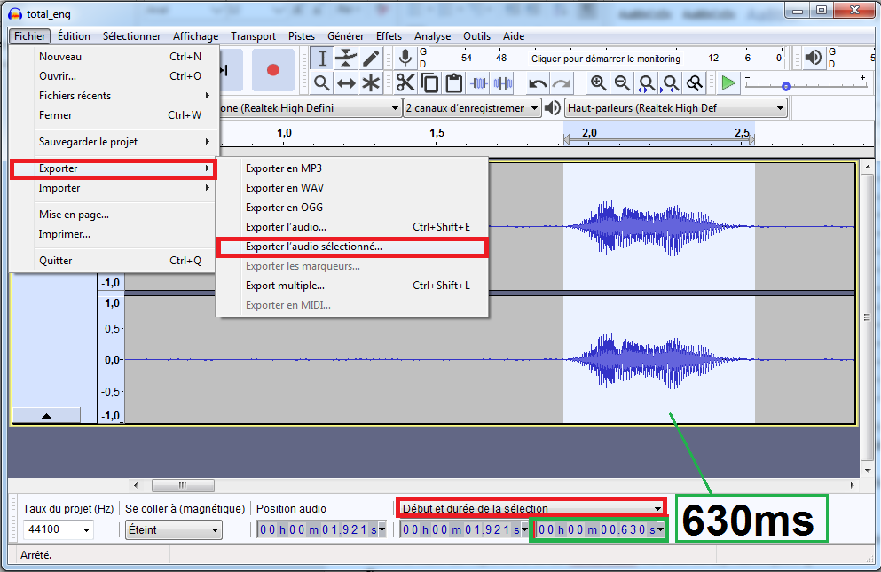
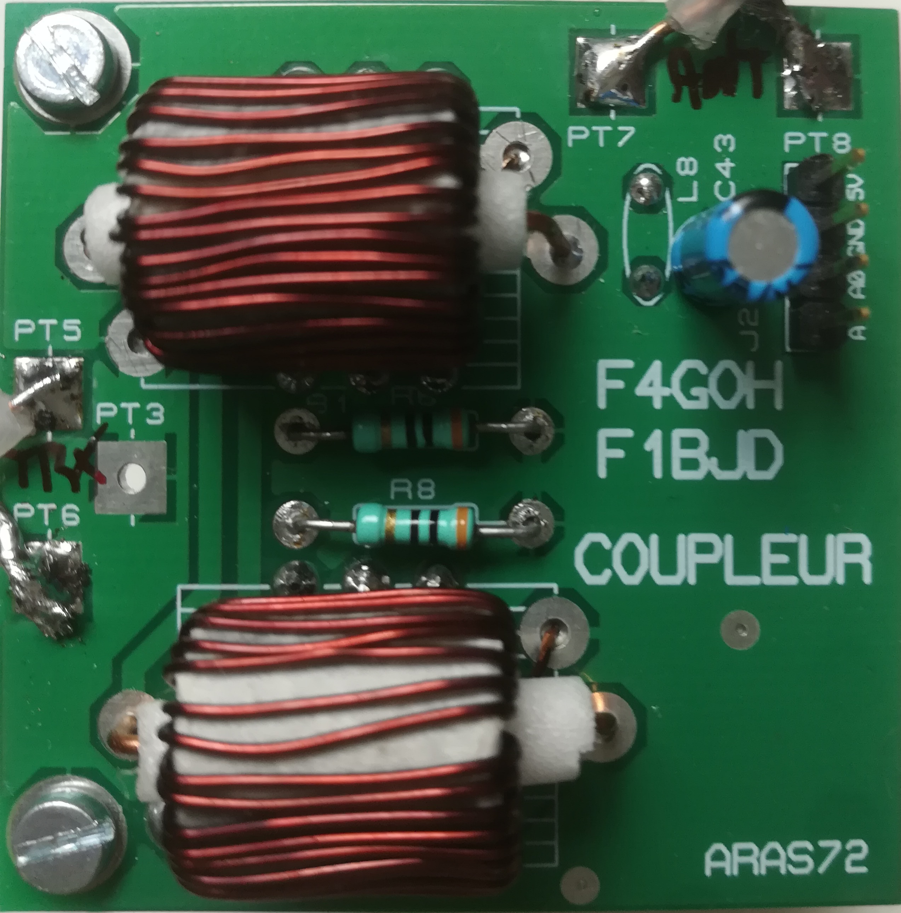
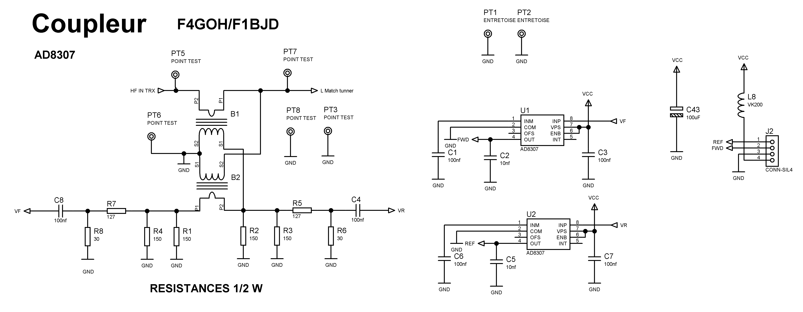
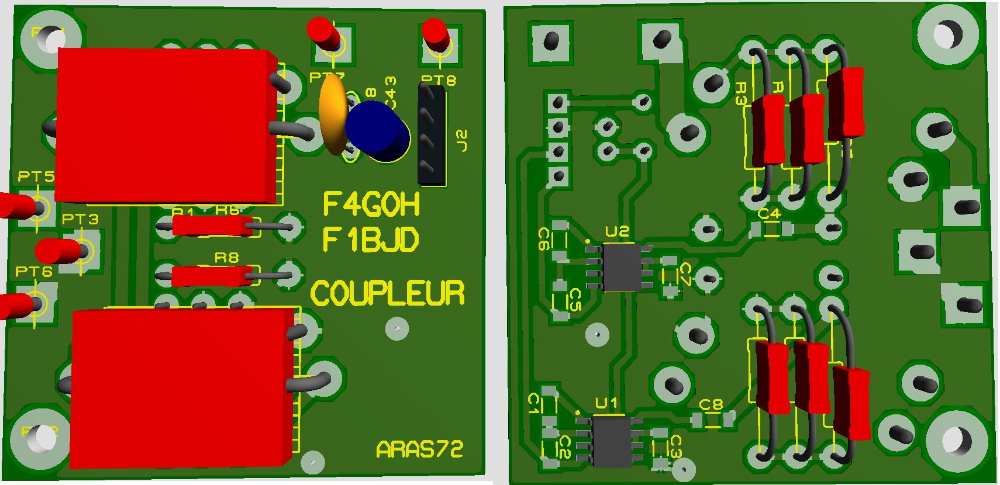
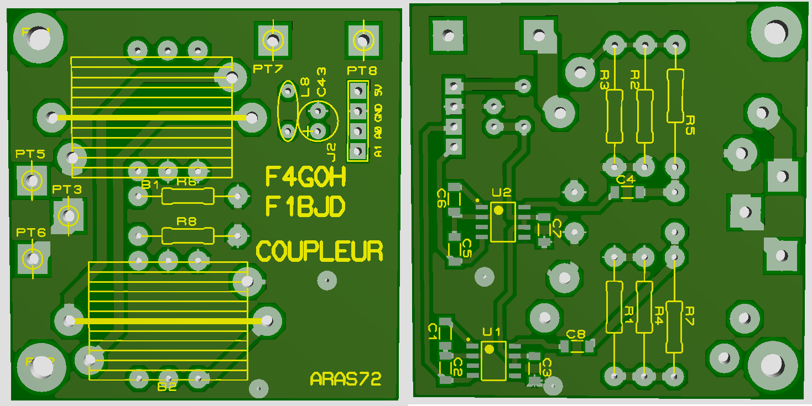
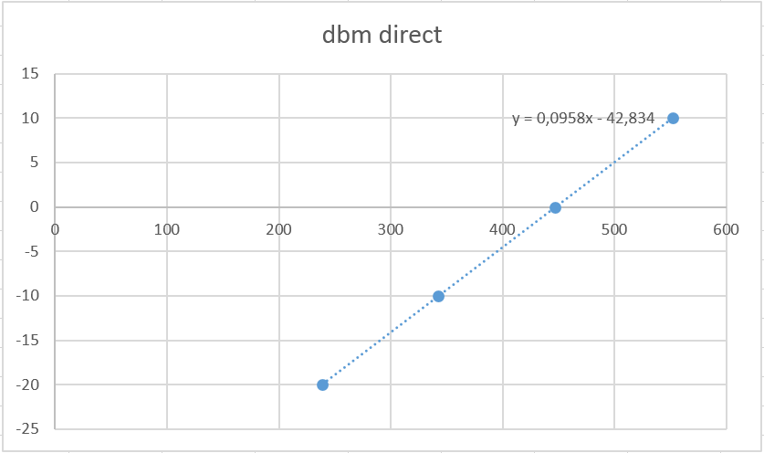
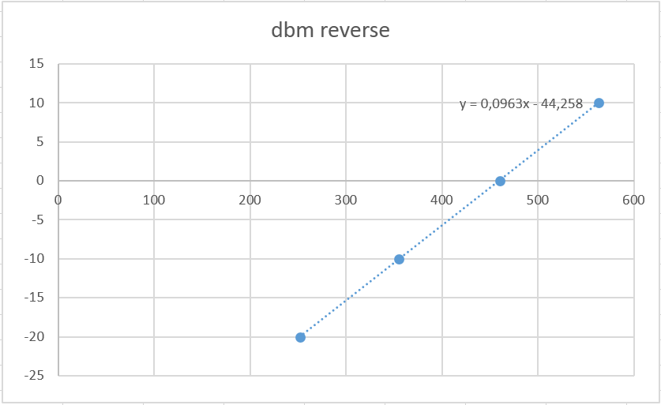

# ROS-mètre HF pour déficient visuel

Anthony Le Cren F4GOH - KF4GOH

** Caractéristiques du ROS-mètre : **

- Gamme de mesures : 1 à 30 MHz.
- Puissance max 100 W.
- Arduino UNO.
- Module MP3 Catalex yx5300.
- Fichiers sons personnalisables.
- Haut-parleurs de PC.
- Mesure avec un coupleur tandem et deux AD8307.
- Coût entre 20 € et 30 € suivant votre stock (Hors boitier).
- Le PCB du coupleur est disponible, si vous êtes intéressés, merci de m'envoyer un mail à : [f4goh@orange.fr](mailto:f4goh@orange.fr)

** 1 Introduction **

Lors du salon HAMEXPO 2019 au Mans, j'ai pu présenter à l'association UNARAF (Union Nationale des Aveugles Radio Amateurs de France) un ROS-mètre HF pour déficient visuel. J'ai en effet tout de suite tenu à participer au HACKATHON afin de présenter mon projet. Le thème est judicieusement choisi, car la plupart du temps les projets dédiés aux personnes handicapées ne sont pas assez mis en avant. J'espère d'ailleurs qu'il y aura plus de participants lors des prochaines éditions. Après quelques modifications du code source, le projet est maintenant prêt à être publié. De plus, cela intéressera probablement les radioamateurs désireux d'utiliser un lecteur MP3 pour d'autres applications comme une balise vocale, ou cela ajoutera un « plus » dans la commande d'un relais VHF ou UHF.

** 2 Description du schéma **

Le schéma s'articule autour d'un Arduino UNO, très classique dans beaucoup de montages. Peu de broches sont utilisées sur l'Arduino. On retrouve bien évidemment les deux entrées analogiques permettant de mesurer les tensions directe et réfléchie issues du coupleur tandem. Un LM385-2,5 V est utilisé comme référence de tension du convertisseur analogique-numérique de l'Arduino (AREF). Deux boutons poussoirs sont nécessaires à l'utilisation du ROS-mètre. Les résistances de rappel interne à l'Arduino (INPUT_PULLUP) sont utilisées. Les boutons poussoirs sont donc actifs au niveau BAS. La génération des messages vocaux est assurée par un module MP3 Catalex yx5300.

Résumé des broches de l'Arduino utilisées :

| **Broches Arduino UNO** | **Composant** |
| --- | --- |
| 5   | TX YX530 module MP3 |
| 6   | RX YX530 module MP3 |
| 8   | Bouton manuel |
| 9   | Bouton Automatique |
| A0  | Sortie Coupleur Reverse |
| A1  | Sortie Coupleur Direct |
| AREF | LM385 référence 2,5 V |

**3 Modes de fonctionnement du ROS-mètre**

Dans son utilisation première, le ROS-mètre ne possède pas d'afficheur. Toutes les informations utiles sont émises vocalement.

Dès la mise sous tension, un message vocal indique que l'instrument est en marche.

Le bouton « Bp Mode » permet de passer du mode manuel à automatique et vice versa.

Si le mode automatique est sélectionné, le ROS-mètre va détecter un signal HF (émetteur en émission) et annoncer vocalement la puissance et le ROS en boucle. Par exemple :

« Puissance 5 watts, ROS 1 point 5 » « Puissance 5 watts, ROS 1 point 5 » etc.

Dans le mode manuel, il faudra appuyer sur le bouton « Bp manual » afin de connaître la puissance et le ROS. Cela permet de ne pas perturber le QSO en cours par rapport au mode automatique plus utile pour les réglages ou les vérifications d'adaptation d'impédance de l'antenne.

**3 Le lecteur MP3 Catalex yx5300**

J'ai cherché un module de lecteur MP3 bon marché et facile à mettre en œuvre. La commande de lecture des fichiers mp3 stockés dans une carte micro-SD se fait grâce à une liaison série à une vitesse de 9600 bauds. Utilisez un casque ou des haut-parleurs de PC sur la prise jack 3,5 mm (sortie audio du module MP3).

La méthode de restitution des messages sonores est basée sur un principe similaire à celui de la voix SNCF Simone bien connue. Il faudra enregistrer un par un les différents mots ou échantillons à l'aide du logiciel Audacity (audacity.png) et noter la durée en millisecondes de chaque fichier comme le montre le tableau page suivante.

Je vous conseille d'enregistrer tous les mots d'un seul coup, en intercalant deux secondes de pause entre chaque échantillon. Il faudra probablement vous y reprendre à plusieurs fois pour enregistrer votre voix de manière correcte. Une fois l'enregistrement terminé, ne pas oublier d'appliquer les deux filtres « réduction de bruit » et « normaliser » dans le menu « effet » d'Audacity.

Table des fichiers mp3 utilisés dans le répertoire « 01 » :

| **Nom du fichier** | **Information** | **Durée (ms)** |
| --- | --- | --- |
| 000.mp3 | zéro | 575 |
| 001.mp3 | un  | 444 |
| 002.mp3 | deux | 313 |
| 003.mp3 | trois | 444 |
| 004.mp3 | quatre | 392 |
| 005.mp3 | cinq | 653 |
| 006.mp3 | six | 679 |
| 007.mp3 | sept | 522 |
| 008.mp3 | huit | 522 |
| 009.mp3 | neuf | 470 |
| 010.mp3 | dix | 549 |
| 011.mp3 | puissance | 784 |
| 012.mp3 | watt | 601 |
| 013.mp3 | mode manuel | 1071 |
| 014.mp3 | mode automatique | 1202 |
| 015.mp3 | ros trop élevé | 1254 |
| 016.mp3 | ros 1 point | 1306 |
| 017.mp3 | ros 2 point | 1411 |
| 018.mp3 | ros 3 point | 1463 |
| 019.mp3 | ros 4 point | 1411 |
| 020.mp3 | ros 5 point | 1463 |
| 021.mp3 | QRT | 679 |
| 022.mp3 | Ros-mètre sous tension | 1593 |

Des exemples de fichiers mp3 sont disponibles dans mon Github (1) : un répertoire appelé 01 contenant les mots en français, un autre répertoire appelé 02 contenant une version en anglais.

Il faudra couper les mots au plus juste afin d'éviter les saccades dans l'enchaînement des annonces vocales.

Le nom des fichiers et des répertoires doit être respecté. Il n'est pas possible d'utiliser comme nom de répertoire et de fichier des caractères alphabétiques. C'est le principal inconvénient de ce lecteur mp3. Heureusement, le côté hardware nécessite peu de câblage.

Le séquencement des annonces vocales des valeurs de ROS est réalisé à l'aide des numéros de fichiers. Lors de la conception du séquenceur vocal, j'ai cherché à connaître l'état du lecteur via la liaison série (lecture en cours, stop, pause) afin d'enchaîner les fichiers naturellement sans utiliser la table de durée. Mais la restitution des séquences était très saccadée et j'ai préféré adopter une solution plus simple et plus courte logiciellement.

Les fichiers mp3 sont copiés dans un répertoire nommé « 01 » d'une carte micro SD formatée en FAT32.

**3 Le Coupleur tandem**

Le coupleur tandem est le même que pour le projet boîte de couplage.

<https://hamprojects.wordpress.com/2016/12/31/hf-automatic-tuner/>

Un circuit imprimé spécifique est utilisé et comporte deux transformateurs (1/26), deux atténuateurs en pi ainsi que deux AD8307. swrsch.png

L'ensemble transformateur et atténuateur réalise une atténuation théorique de 29 dB +14 dB = 43 dB. En effet, l'AD8307 n'est pas capable de mesurer des valeurs au-delà de 17 dBm. Si une puissance de 100 W (50 dbm) est injectée dans le coupleur, l'AD8307 mesure alors environ 7 dBm. On reste ainsi dans la plage de mesure de l'amplificateur logarithmique. Cette information sera intégrée dans le logiciel sous forme d'une directive de compilation #define OffsetdBmBridge 43

Le transformateur est réalisé avec trois T50-2 côte à côte et 26 tours de fil émaillé (diamètre 0,6 mm)

Il n'est pas obligatoire d'utiliser ce coupleur en particulier. Par contre, il est nécessaire que les tensions continues injectées dans l'Arduino UNO (permettant de mesurer les puissances directes et réfléchies) respectent la valeur maximale AREF du convertisseur analogique numérique (CAN) soit 2,5 V. Évitez au possible d'utiliser la tension de référence 5 V interne à l'Arduino pour le CAN, cela réduit la plage de mesure et les résultats sont fluctuants et moins précis.

| **Désignation** | **Qté** | **Valeur** |
| --- | --- | --- |
| &nbsp; | &nbsp; | &nbsp; |
| Résistances | &nbsp; | &nbsp; |
| R1-R4 | 4   | 150 |
| R5, R7 | 2   | 127 |
| R6, R8 | 2   | 30  |
| &nbsp; | &nbsp; | &nbsp; |
| Condensateurs | &nbsp; | &nbsp; |
| C1, C3, C4, C6-C8 | 6   | 100 nF |
| C2, C5 | 2   | 10 nF |
| C43 | 1   | 100 µF |
| &nbsp; | &nbsp; | &nbsp; |
| Circuits intégrés | &nbsp; | &nbsp; |
| U1, U2 | 2   | AD8307 |
| &nbsp; | &nbsp; | &nbsp; |
| Divers | &nbsp; | &nbsp; |
| J2  | 1   | CONN-SIL4 |
| L8  | 1   | VK200 |

**4 Le logiciel**

Le programme « vocalSwrMeter.ino » ne nécessite aucune bibliothèque spécifique.

La configuration du logiciel se fait en activant ou désactivant les directives de compilation #define par l'ajout de commentaire au début du programme.

Deux exemples de configuration :

| Voix en anglais, pas de debug, pas de calibration personnelle | Voix en français, debug activé, calibration personnelle. |
| --- | --- |
| //SWR meter configuration  //#define LANGUAGE_FR  #define LANGUAGE_EN  //#define DEBUG_SWR  //#define DEBUG_DBM  //#define PERSONAL_CALIBRATION #define OffsetdBmBridge 45 | //SWR meter configuration  #define LANGUAGE_FR  //#define LANGUAGE_EN  #define DEBUG_SWR  #define DEBUG_DBM  #define PERSONAL_CALIBRATION #define OffsetdBmBridge 45 |

La configuration par défaut (pas de calibration personnelle) utilise la fonction NtodBm suivante calculant la puissance en dBm en fonction de la valeur du CNA.

//compute power in dbm (theoric formula)

float NtodBm(int N)

{

return (100 \* (float) N) / 1024 - 90 + OffsetdBmBridge;

}

Cette formule est issue de la documentation constructeur de l'AD8307 et du CAN de l'Arduino. La configuration par défaut est amplement suffisante pour faire des essais.

Avec un émetteur et le ROS-mètre sur une charge de 50 ohms, injecter une porteuse HF de 7 MHz de 1 watt. Ajuster la valeur de OffsetdBmBridge de telle manière que la puissance corresponde (en général plus ou moins 2 dB autour de 45).

Calibration personnelle :

Activer le debug (#define DEBUG_SWR) permettant de visualiser les valeurs du CAN dans le moniteur série (9600 bits/s)

À l'aide d'un générateur HF calibré, injecter différentes puissances (entre -20 dbm et 10 dbm) dans le coupleur (toujours sur charge 50 ohms) et relever la valeur numérique (CAN fwd) de la tension directe correspondante. Réitérer la mesure pour la tension réfléchie en inversant le sens du signal HF dans le coupleur.

Les valeurs obtenues avec mon coupleur sont les suivantes :

| **Générateur HF (dBm)** | **Valeur CAN fwd** | **Valeur CAN rev** |
| --- | --- | --- |
| 10  | 552 | 563 |
| 0   | 447 | 460 |
| \-10 | 342 | 355 |
| \-20 | 239 | 252 |

Il ne reste plus qu'à tracer la droite avec un tableur comme Excel et calculer la courbe de tendance. (direct.png, reverse.png, tendance.png)

Pour finir, recopier les formules dans les fonctions NtodBmForward et NtodBmReverse à la fin du programme.

| float NtodBmForward(int N)  {  return 0.0958 \* (float) N - 42.834;  } | float NtodBmReverse(int N)  {  return 0.0963 \* (float) N - 44.258;  } |
| --- | --- |

**5 Conclusion**

Je pense que ce montage rendra bien des services, même aux personnes sans handicap. Dans ce projet, j'ai été très intéressé par la réalisation du séquenceur vocal et l'enregistrement des échantillons audio. Le coût du module MP3 Catalex yx5300 est vraiment dérisoire et celui-ci sera très utile dans d'autres expérimentations comme avec un DRA818 (mini-émetteur FM VHF/UHF).

Le montage est facile à construire et les composants se trouvent facilement sur Internet.

73 et bonnes bricoles.

Anthony

**6 Liens eBay / AliExpress** \*

<https://www.ebay.fr/itm/YX5300-UART-Control-Serial-MP3-Music-Player-Module-For-Arduino-AVR-ARM-PIC-NEW/254361858165>

<https://fr.aliexpress.com/item/20PCS-LM385Z-2-5-LM385Z2-5-2-5V-TO-92-IC/32226686916.html>

<https://www.ebay.fr/itm/5pcs-AD8307ARZ-AD8307AR-SOP-8-NEW-IC/281295146209>

<https://www.ebay.fr/itm/Latest-Version-Arduino-UNO-R3-ATMEGA328P-16AU-CH340G-Board-Micro-USB-Cable/153759306145>

\* Liens susceptibles d'être supprimés ou changés.